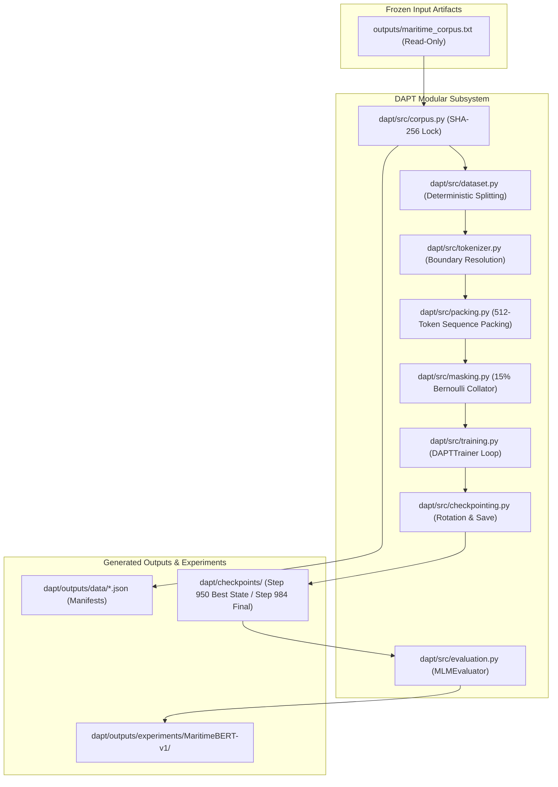

# Subsystem Architecture Diagram

This document contains the source Mermaid diagram and architectural breakdown of the **DAPT Subsystem Components**.

```mermaid
flowchart TD
    subgraph FrozenInputs ["Frozen Input Artifacts"]
        CorpusFile["outputs/maritime_corpus.txt (Read-Only)"]
    end

    subgraph DAPT Core ["DAPT Modular Subsystem"]
        CorpusModule["dapt/src/corpus.py (SHA-256 Lock)"]
        SplitModule["dapt/src/dataset.py (Deterministic Splitting)"]
        TokenizerModule["dapt/src/tokenizer.py (Boundary Resolution)"]
        PackingModule["dapt/src/packing.py (512-Token Sequence Packing)"]
        MaskingModule["dapt/src/masking.py (15% Bernoulli Collator)"]
        TrainerModule["dapt/src/training.py (DAPTTrainer Loop)"]
        CheckpointModule["dapt/src/checkpointing.py (Rotation & Save)"]
        EvaluatorModule["dapt/src/evaluation.py (MLMEvaluator)"]
    end

    subgraph Experiment Outputs ["Generated Outputs & Experiments"]
        Manifests["dapt/outputs/data/*.json (Manifests)"]
        CheckpointsDir["dapt/checkpoints/ (Step 950 Best State / Step 984 Final)"]
        ReleaseArtifact["dapt/outputs/experiments/MaritimeBERT-v1/"]
    end

    CorpusFile --> CorpusModule --> Manifests
    CorpusModule --> SplitModule --> TokenizerModule --> PackingModule
    PackingModule --> MaskingModule --> TrainerModule
    TrainerModule --> CheckpointModule --> CheckpointsDir
    CheckpointsDir --> EvaluatorModule --> ReleaseArtifact
```
