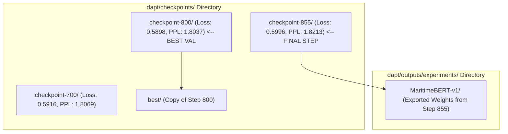

# Checkpoint Lifecycle Diagram

```mermaid
flowchart TD
    subgraph CheckpointsDir ["dapt/checkpoints/ Directory"]
        Step700["checkpoint-700/ (Loss: 0.5916, PPL: 1.8069)"]
        Step800["checkpoint-800/ (Loss: 0.5898, PPL: 1.8037) <-- BEST VAL"]
        Step855["checkpoint-855/ (Loss: 0.5996, PPL: 1.8213) <-- FINAL STEP"]
        BestSymlink["best/ (Copy of Step 800)"]
    end

    subgraph ReleaseDir ["dapt/outputs/experiments/ Directory"]
        MaritimeBERTv1["MaritimeBERT-v1/ (Exported Weights from Step 855)"]
    end

    Step800 --> BestSymlink
    Step855 --> MaritimeBERTv1
```
