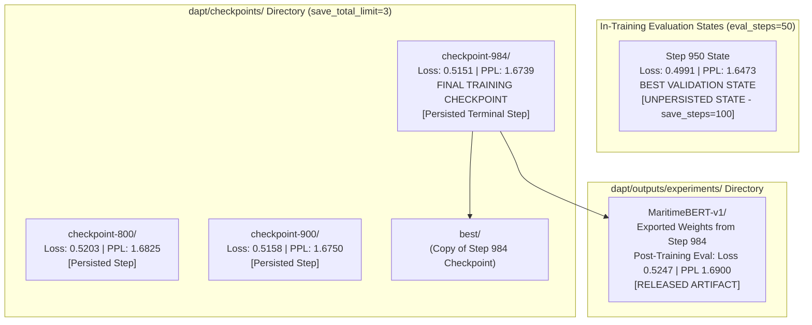

# Checkpoint Lifecycle & Model State Architecture

```mermaid
flowchart TD
    subgraph InTrainingStates ["In-Training Evaluation States (eval_steps=50)"]
        Step950["Step 950 State\nLoss: 0.4991 | PPL: 1.6473\nBEST VALIDATION STATE\n[UNPERSISTED STATE - save_steps=100]"]
    end

    subgraph CheckpointsDir ["dapt/checkpoints/ Directory (save_total_limit=3)"]
        Step800["checkpoint-800/\nLoss: 0.5203 | PPL: 1.6825\n[Persisted Step]"]
        Step900["checkpoint-900/\nLoss: 0.5158 | PPL: 1.6750\n[Persisted Step]"]
        Step984["checkpoint-984/\nLoss: 0.5151 | PPL: 1.6739\nFINAL TRAINING CHECKPOINT\n[Persisted Terminal Step]"]
        BestSymlink["best/\n(Copy of Step 984 Checkpoint)"]
    end

    subgraph ReleaseDir ["dapt/outputs/experiments/ Directory"]
        MaritimeBERTv1["MaritimeBERT-v1/\nExported Weights from Step 984\nPost-Training Eval: Loss 0.5247 | PPL 1.6900\n[RELEASED ARTIFACT]"]
    end

    Step984 --> BestSymlink
    Step984 --> MaritimeBERTv1
```
