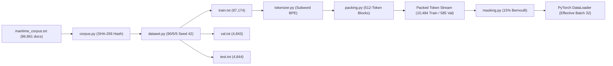

# Data Flow Diagram

```mermaid
flowchart LR
    RawCorpus["maritime_corpus.txt (96,861 docs)"] --> Ingestion["corpus.py (SHA-256 Hash)"]
    Ingestion --> Split["dataset.py (90/5/5 Seed 42)"]
    Split --> TrainSet["train.txt (87,174)"]
    Split --> ValSet["val.txt (4,843)"]
    Split --> TestSet["test.txt (4,844)"]
    
    TrainSet --> Tokenize["tokenizer.py (Subword BPE)"]
    Tokenize --> Pack["packing.py (512-Token Blocks)"]
    Pack --> Stream["Packed Token Stream (10,484 Train / 585 Val)"]
    Stream --> Mask["masking.py (15% Bernoulli)"]
    Mask --> ModelInput["PyTorch DataLoader (Effective Batch 32)"]
```
