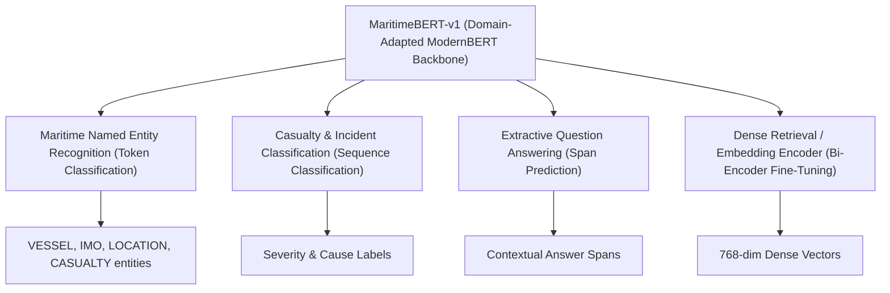

# Downstream Tasks Diagram

```mermaid
flowchart TD
    Backbone["MaritimeBERT-v1 (Domain-Adapted ModernBERT Backbone)"]
    
    Backbone --> Task1["Maritime Named Entity Recognition (Token Classification)"]
    Backbone --> Task2["Casualty & Incident Classification (Sequence Classification)"]
    Backbone --> Task3["Extractive Question Answering (Span Prediction)"]
    Backbone --> Task4["Dense Retrieval / Embedding Encoder (Bi-Encoder Fine-Tuning)"]

    Task1 --> Out1["VESSEL, IMO, LOCATION, CASUALTY entities"]
    Task2 --> Out2["Severity & Cause Labels"]
    Task3 --> Out3["Contextual Answer Spans"]
    Task4 --> Out4["768-dim Dense Vectors"]
```
