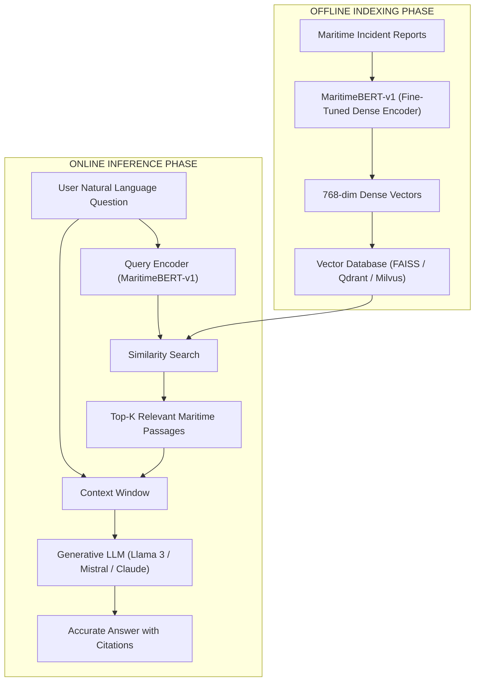

# RAG Architecture Diagram

```mermaid
flowchart TD
    subgraph Offline ["OFFLINE INDEXING PHASE"]
        MaritimeDocs["Maritime Incident Reports"] --> FineTunedEncoder["MaritimeBERT-v1 (Fine-Tuned Dense Encoder)"]
        FineTunedEncoder --> Vectors["768-dim Dense Vectors"]
        Vectors --> VectorIndex["Vector Database (FAISS / Qdrant / Milvus)"]
    end

    subgraph Online ["ONLINE INFERENCE PHASE"]
        UserQuery["User Natural Language Question"] --> QueryEncoder["Query Encoder (MaritimeBERT-v1)"]
        QueryEncoder --> Search["Similarity Search"]
        VectorIndex --> Search
        Search --> TopK["Top-K Relevant Maritime Passages"]
        TopK --> LLMContext["Context Window"]
        UserQuery --> LLMContext
        LLMContext --> LLM["Generative LLM (Llama 3 / Mistral / Claude)"]
        LLM --> FinalAnswer["Accurate Answer with Citations"]
    end
```
