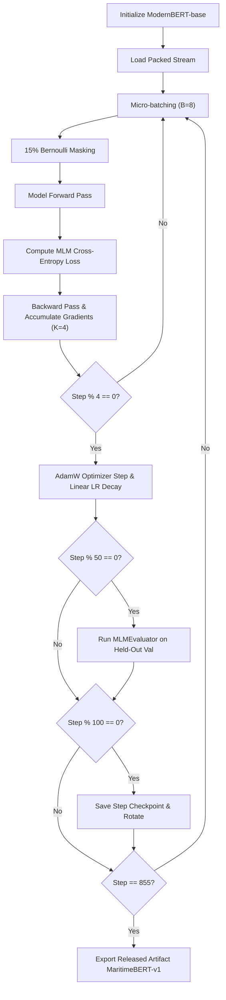

# Training Pipeline Diagram

```mermaid
flowchart TD
    Init["Initialize ModernBERT-base"] --> LoadData["Load Packed Stream"]
    LoadData --> Batch["Micro-batching (B=8)"]
    Batch --> Mask["15% Bernoulli Masking"]
    Mask --> Forward["Model Forward Pass"]
    Forward --> Loss["Compute MLM Cross-Entropy Loss"]
    Loss --> Backprop["Backward Pass & Accumulate Gradients (K=4)"]
    Backprop --> StepCheck{"Step % 4 == 0?"}
    StepCheck -- Yes --> OptStep["AdamW Optimizer Step & Linear LR Decay"]
    StepCheck -- No --> Batch
    OptStep --> EvalCheck{"Step % 50 == 0?"}
    EvalCheck -- Yes --> ValEval["Run MLMEvaluator on Held-Out Val"]
    EvalCheck -- No --> SaveCheck
    ValEval --> SaveCheck{"Step % 100 == 0?"}
    SaveCheck -- Yes --> SaveCheckpoint["Save Step Checkpoint & Rotate"]
    SaveCheck -- No --> MaxStepCheck{"Step == 855?"}
    SaveCheckpoint --> MaxStepCheck
    MaxStepCheck -- Yes --> ExportFinal["Export Released Artifact MaritimeBERT-v1"]
    MaxStepCheck -- No --> Batch
```
