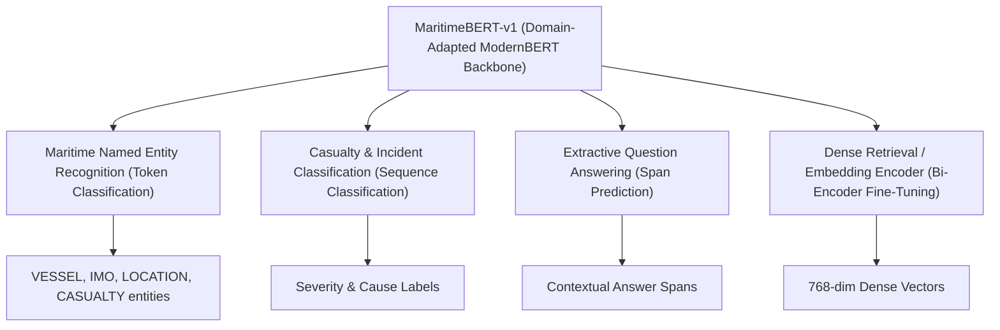

# 10. Downstream Task Fine-Tuning Guide

`MaritimeBERT-v1` provides a domain-adapted foundation model ready for task-specific supervised fine-tuning across maritime NLP tasks.

---

## 1. Model Loading via Hugging Face APIs

```python
from transformers import AutoTokenizer, AutoModelForMaskedLM

model_path = "dapt/outputs/experiments/MaritimeBERT-v1"

tokenizer = AutoTokenizer.from_pretrained(model_path)
model = AutoModelForMaskedLM.from_pretrained(model_path)
```

---

## 2. Downstream Fine-Tuning Task Architectures



### 1. Named Entity Recognition (NER)
- **Model**: `AutoModelForTokenClassification.from_pretrained(model_path, num_labels=N)`
- **Entities**: `VESSEL_NAME`, `IMO_NUMBER`, `LOCATION_GEOGRAPHIC`, `COORDINATES`, `CASUALTY_TYPE`, `WEATHER_CONDITION`.

### 2. Incident Classification
- **Model**: `AutoModelForSequenceClassification.from_pretrained(model_path, num_labels=5)`
- **Labels**: Occurrence cause tagging (e.g., Equipment Failure, Human Error, Environmental Factor).

### 3. Extractive Question Answering
- **Model**: `AutoModelForQuestionAnswering.from_pretrained(model_path)`
- **Task**: Predicting start and end character token spans for specific incident queries.
