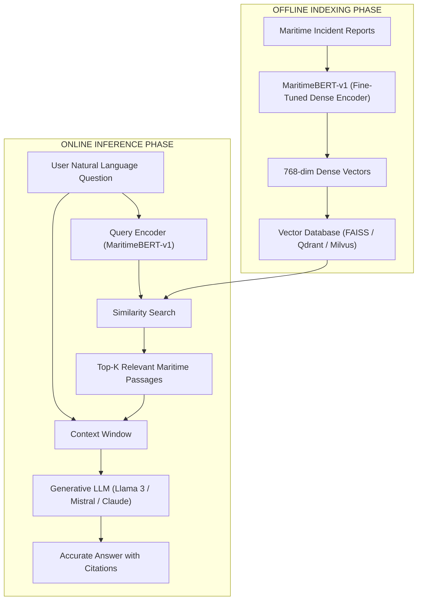

# 11. Retrieval-Augmented Generation (RAG) Architecture

This document clarifies the architectural integration of `MaritimeBERT-v1` into Retrieval-Augmented Generation (RAG) pipelines.

---

## 1. Architectural Clarification: Model vs. RAG System

> [!IMPORTANT]
> **Architectural Clarification**: `MaritimeBERT-v1` is **not** itself a Retrieval-Augmented Generation (RAG) system.
> It serves as a domain-adapted dense encoder backbone within a larger offline indexing and online LLM retrieval architecture.

---

## 2. Offline vs. Online RAG Pipeline

---

## 3. Training Requirements for Dense Retrieval

DAPT pre-training adapts the backbone to maritime text under the Masked Language Modeling objective. To convert `MaritimeBERT-v1` into a high-performance dense retriever:
1. Additional **Contrastive Fine-Tuning** (e.g., Multiple Negatives Ranking Loss using query-document pairs) is required to align sequence embedding spaces.
2. The fine-tuned bi-encoder generates 768-dimensional dense vectors stored in FAISS or Qdrant vector databases.
